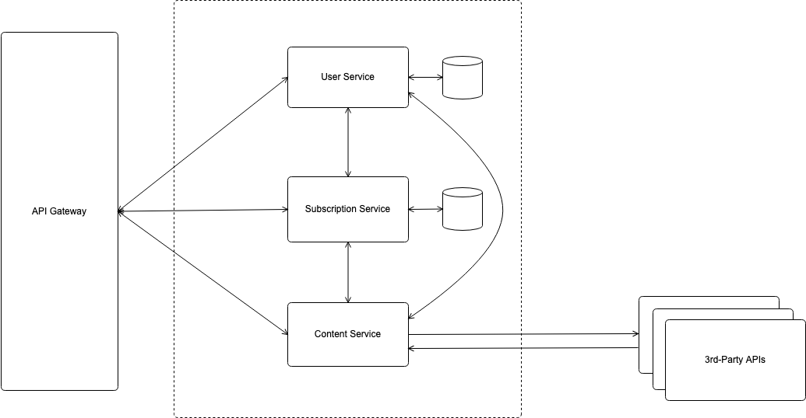

# Content Provider Microservices

This project is part of a course named Microservice Architectures and Serverless Computing at Aalto University in Spring 2019.

This system runs in a Kubernetes cluster and serves as a REST API, which could be called by clients, such as a mobile application. It gathers contents from different sources through 3rd-party APIs, and users can subscribe to ones that interest them. As this project aims at the microservice architecture of the system, most of the service functionalities are mocked, including data from databases and 3rd-party APIs. This means there are no actual databases and API calls to external services in the implementation. However, to test and demonstrate the system, there are logs indicating when the service would actually call a 3rd-party API.

## Architecture



The system consists of an API Gateway and three services. The API Gateway exposes public endpoints and proxy incoming requests to corresponding microservices. All services are implemented with Node.js, including the API Gateway to ease customization.

### API Gateway

### User Service (Stateful)

User Service is mainly responsible for user authentication, and it also provides user information to other services. It has a database which stores user data.

### Subscription Service (Stateful)

Subscription Service handles modifications of users' subscriptions, e.g., subscribing and unsubscribing. In addition, other services can query to Subscription Service asking what content providers a user is subscribed to. Its database stores users' subscriptions.

**Sequence Diagram Example**


### Content Service (Stateless)

Content Service provides contents to users. When receiving a request, it asks Subscription Service for the user's subscriptions and fetches contents from external APIs. A cache could be added to prevent from hitting external APIs' rate limits and to speed up the process.

**Sequence Diagram Example**


## API Specification

A few endpoints have been implemented for testing the operational aspects, so this list is not a complete set. Only the endpoints marked with stars are exposed through the API Gateway.

### User Service

* `GET /api/auth/verify`

| Type | Format |
| - | - |
| Request Headers | `Authorization: <string>` (required)<br>Example: `Bearer <auth token>` |
| Response | `200 OK`<br>`Body:`<br>`{`<br>&emsp;`"id": <integer>,`<br>&emsp;`"username": <string>`<br>`}`<br><br>`401 Unauthorized` |

### Subscription Service

* `POST /api/subscriptions` *

| Type | Format |
| - | - |
| Request Headers | `Authorization: <string>` (required)<br>Example: `Bearer <auth token>` |
| Request Body | `providerId: <integer>` (required) |
| Response | `201 Created`<br>`400 Bad Request`<br>`401 Unauthorized` |

* `GET /api/subscriptions`

| Type | Format |
| - | - |
| Request Query | `userId: <integer>` (required) |
| Response | `200 OK`<br>`Body:`<br>`{`<br>&emsp;`"providerIds": [<integer>]`<br>`}`<br><br>`400 Bad Request`<br>`404 Not Found` |

### Content Service

* `GET /api/contents` *

| Type | Format |
| - | - |
| Request Headers | `Authorization: <string>` (required)<br>Example: `Bearer <auth token>` |
| Response | `200 OK`<br>`Body:`<br>`{`<br>&emsp;`"contents": [`<br>&emsp;&emsp;`{`<br>&emsp;&emsp;&emsp;`"author": <string>,`<br>&emsp;&emsp;&emsp;`"title": <string>,`<br>&emsp;&emsp;&emsp;`"description": <string>,`<br>&emsp;&emsp;&emsp;`"publishedAt": <string>`<br>&emsp;&emsp;`}`<br>&emsp;`]`<br>`}`<br><br>`401 Unauthorized` |

## Operational Aspects of Microservices

### Secret Management

Kubernetes Secret objects are used for protecting an auth token secret and access keys for 3rd-party APIs. `secret.yaml` contains all secrets encoded in base64, which is actually easy to decode. In production, this file might be separated to another repository which allows limited access.

Security can be improved by using Hashicorp Vault, but secrets will be maintained independently from code repositories.

Encode a secret:

```
echo -n "<secret>" | base64
```

Decode an encoded secret:

```
echo "<encoded secret>" | base64 -D
```

### Tracing

An infrastructure of Jaeger runs in the same Kubernetes cluster. Jaeger clients have been integrated to API Gateway and all services to transmit spans and traces to a Jaeger agent.

The UI can be accessed via `http://localhost:80`. It provides visualized spans of requests passing through services.

### Dynamic Configuration

Consul and Consul Template are used for dynamic configuration. This system allows switch on/off particular content providers. For example, if a user has subscribed to BBC News, but it's been disabled, Content Service will not get contents from BBC's API.

A cluster of Consul servers runs in the cluster. All providers are enabled by default. The Consul UI is a NodePort, so it can be accessed via `http://localhost:<port>`, where the node port can be checked by running:

```
kubectl get svc consul-ui
```

Note that although the Consul cluster is complete deleted, its data still remain. To complete clean it, remove its `PersistentVolumes` and `PersistenVolumeClaims`.

Consul Template runs in Content Service as a daemon. It watches changes of key-value pairs on Consul and automatically update the configuration file used by Content Service.

Key Example:

```
/services/content-service/providers/bbc/enabled
```

The value can be either `true` or `false`.

## Project Setup

### Required tools

1. Docker
2. Kubernetes (kubectl)
3. Git
4. Helm<br>`brew install kubernetes-helm`

### Setup Commands